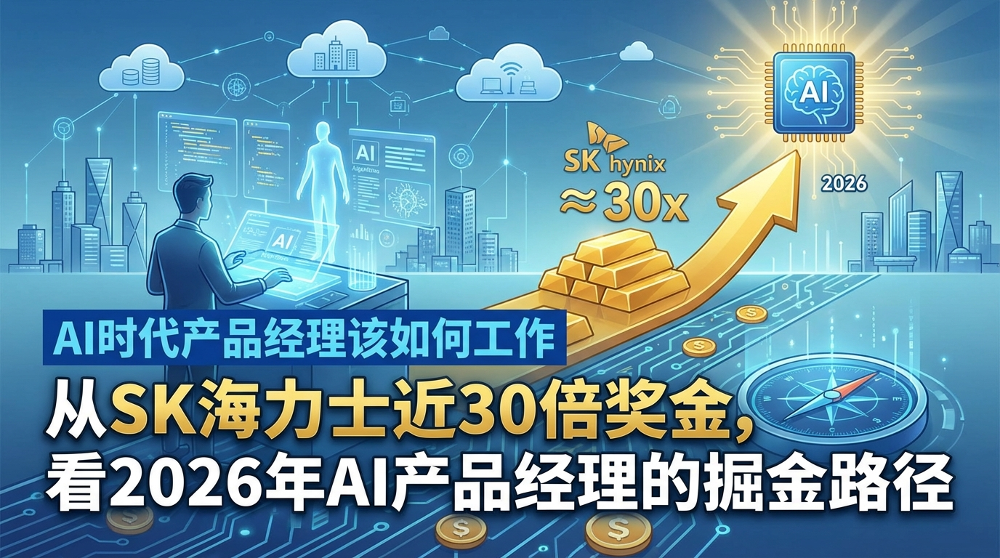

## 从SK海力士近30倍奖金，看2026年AI产品经理的掘金路径

**日期：2026-02-05**

2026年的春节刚过，科技圈就被一则薪酬消息炸醒了。韩国存储芯片巨头SK海力士宣布，向员工发放巨额奖金，部分员工拿到手的金额甚至接近年薪的30倍（按月基薪计算的极致绩效倍数）。

这笔“泼天富贵”的背后逻辑很简单：AI算力需求在2026年依然狂飙，作为英伟达HBM（高带宽内存）的核心供应商，SK海力士躺在了金矿上。

看着硬件厂商赚得盆满钵满，处于应用层的产品经理们（PM）难免焦虑。我们没有HBM的技术壁垒，也没赶上芯片制造的风口。但在2026年这个“马年”，AI行业已经从“大模型军备竞赛”进入了“应用落地与具身智能”的深水区。

作为产品经理，如果不希望在35岁前被优化，而是像新闻里那位“96年女生月入百万宣布30岁退休”一样掌握主动权，就必须看清2026年的三大掘金路径。

### 一、 具身智能爆发：从“屏幕PM”转型“空间PM”

如果说2023-2024是LLM（大语言模型）的元年，那么2026年绝对是具身智能（Embodied AI）的爆发年。

就在最近，沉寂许久的贾跃亭再次杀回视野，发布了起售价19990美元的人形机器人。不管你是否看好他的商业信誉，但这一价格点不仅击穿了行业底线，更释放了一个强烈信号：**AI正在长出“手脚”，走出屏幕，进入物理世界。**

对于产品经理而言，这是一个巨大的范式转移。

过去十年，PM的工作核心是“屏幕交互”——设计App界面、优化点击率、调整文字排版。但在2026年，随着人形机器人和智能硬件的普及，PM需要进化为“空间PM”：

1.  **理解多模态感知**：你不再只是处理文本输入，而是要处理视觉、听觉、触觉甚至平衡感。你需要定义机器人“看到”障碍物时的决策逻辑，而不仅仅是弹窗提示。
2.  **软硬结合的思维**：贾跃亭的机器人之所以能把价格打下来，核心在于软硬解耦与供应链控制。PM需要懂得，哪些功能靠边缘算力解决，哪些靠云端大模型，如何在延迟（Latency）和精度之间做取舍。
3.  **场景即产品**：不再是“用户在手机上点外卖”，而是“机器人如何规划路径去门口取外卖并摆上桌”。

如果你还停留在画Axure线框图，那只能被时代淘汰；现在的PM，需要懂传感器、懂SLAM（即时定位与地图构建）的应用场景。

### 二、 信任经济：在这个“摆拍”泛滥的时代做“鉴真”产品

AI生成的能级在2026年达到了顶峰，但也带来了巨大的副作用：信息污染。

看看最近的热搜：“摆拍孩子险被人贩子拐走博主被罚”、“‘醒酒饮料’一瓶快速解酒？假的”。虚假内容、伪科学营销、AI合成的诈骗视频充斥网络。甚至连爱泼斯坦案的视频中都出现了令人匪夷所思的细节，真假难辨。

在这种环境下，**“可信度”成为了2026年最稀缺的产品属性。**

AI产品经理的一个重要掘金方向，就是**构建基于信任的AI产品**：

*   **内容溯源与水印技术**：如果你的产品涉及内容生成，必须内置不可篡改的标识。
*   **反向AI应用**：开发能够识别“摆拍”、识别Deepfake、识别营销谎言的工具。用户愿意为“真相”付费。
*   **安全合规壁垒**：随着国家对数据安全和互联网内容的监管收紧（如对摆拍博主的处罚），懂合规、能设计出符合伦理规范的AI产品的PM，身价将水涨船高。

不要只想着怎么用AI生成爆款文章，去思考怎么用AI帮用户过滤掉99%的垃圾信息，这才是2026年的刚需。

### 三、 超级个体：不仅是工具的使用者，更是资源的调度者

“96年女生月入百万宣布30岁退休”的新闻虽然有幸存者偏差，但它揭示了AI时代的一个核心红利：**超级个体的崛起。**

在2026年，一个优秀的AI产品经理，其产出应该等于过去的一个团队。

*   **需求分析**：利用Agent自动爬取竞品数据、分析用户评论（参考“《年少有为》热播带动原著阅读热”这类文化现象，AI能瞬间分析出用户的情绪high点）。
*   **原型设计**：通过自然语言直接生成UI/UX原型。
*   **开发落地**：利用Cursor等AI编程工具，独立完成MVP（最小可行性产品）的开发。

然而，很多PM陷入了误区，以为会写Prompt就是AI PM。错！**真正的核心竞争力是“判断力”和“资源调度能力”。**

随着我国“多举措扩大进口”，全球供应链更加开放，信息差依然存在。优秀的产品经理不再局限于国内内卷，而是利用AI打破语言障碍，将国内成熟的“马元素产品”（借着马年热度）快速出海，或者将国外的优质技术（如先进的开源模型）引入国内垂直场景。

你不仅要会用AI干活，更要像CEO一样思考：**如果我有无限的算力及无数的AI员工，我该解决什么问题？**

### 小结：快马加鞭，但不要脱缰

2026年是农历马年，市场上各种“马元素”产品正在快马加鞭地上新。这恰恰是AI产品经理当下的写照：**速度要快，但在高速奔跑中不能失控。**

正如“车辆高速强行变道，后车直接撞了”这则新闻的警示，盲目追逐风口（如盲目跟风做大模型基座）只会导致惨烈的事故。

SK海力士的员工拿到了30倍奖金，那是属于基础设施建设者的红利。而作为应用层的产品经理，我们的红利在于**将冰冷的算力转化为有温度、可信任、能解决物理世界问题的产品。**

不要因为立陶宛承认错误、美俄条约失效等宏观新闻而感到无力，也不要因为别人退休而焦虑。在2026年，只要你以此为基点，从屏幕走向空间，从生成走向鉴真，从执行者走向决策者，你就是那个掘金的人。
