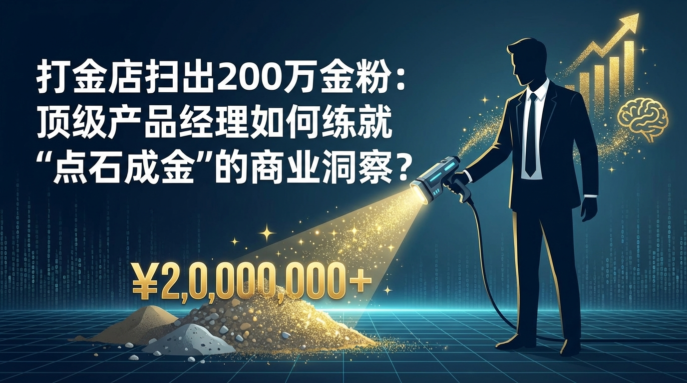

最近，一条新闻在2026年的初春刷爆了社交网络：一家不起眼的打金店，竟然靠着清理地板缝隙、回收加工过程中的损耗，一个月内扫出了价值200万人民币的金粉。

这个看似荒诞却真实发生的案例，给了互联网和科技圈一记响亮的耳光。在很多产品经理（PM）还在为日活（DAU）焦虑、为界面像素纠结时，传统的实体生意人用最朴素的方式告诉了我们什么是“极致的商业变现”。

2026年的今天，产品经理的薪资分化已呈断崖式下跌与指数级上升并存的态势。有人在AI的冲击下焦虑失业，而有人却能拿走千万年薪加股权分红。当我们在谈论“如何成为年入千万的产品经理”时，我们谈论的绝不是画原型图的速度，而是像那位打金店老板一样——在看似无用的“尘埃”中，发现黄金的商业洞察力。

### 一、 告别“功能思维”，拥抱“剩余价值”

打金店老板之所以能发财，是因为他看到了别人眼中的“垃圾”（粉尘）其实是形态改变了的“资产”（黄金）。

对于普通产品经理而言，产品的交付物是App、是网站、是硬件；但对于顶级产品经理而言，产品的交付物是**资产的增值**。

让我们看看当下的热点，**“96年女生月入百万宣布30岁退休”**的新闻再次刺痛了打工人的神经。很多人只看到了她退休的结果，却忽略了她达成这一目标的路径。这类高收入群体，往往不是靠出卖时间（Time-based），而是靠构建资产（Asset-based）。

顶级PM在看一个项目时，不会只盯着主流程。就像打金店卖首饰是主营业务，但扫金粉是极高利润的副业。在互联网产品中，你的“金粉”在哪里？

*   **数据资产化：** 用户在使用产品过程中产生的“废弃数据”，是否能经过脱敏处理，变成行业报告或精准营销的燃料？
*   **流量的二次分发：** 那些没转化成功的流量（类似于损耗的金粉），是否被引导到了合理的下游，还是直接流失了？
*   **供应链的边角料：** 在电商或硬件产品中，供应链的冗余产能是否被低成本转化为新的SKU？

年入千万的PM，本质上是一个拿着产品地图的投资人。他们懂得：**利润往往隐藏在系统的耗散结构中。**

### 二、 警惕“伪需求”，像鉴别黄金一样鉴别“伪风口”

想从地缝里扫出黄金，首先你得能通过化学试剂分辨出什么是真金，什么是黄铜。

近期市面上出现了一种所谓的**“醒酒饮料”号称一瓶快速解酒，结果被官方辟谣是假的**。这就是典型的“伪需求”产品。普通PM看到“春节酒局多”这个场景，立刻兴奋地去立项做解酒产品，结果陷入了概念炒作的死胡同，最终被市场证伪。

顶级产品经理具备一种极度冷酷的“证伪能力”。在2026年，虽然技术如**小米YU7现身美国高速公路**这般突飞猛进，展示了中国智造出海的硬实力，但商业的本质依然是交换。

要练就千万级的洞察力，必须建立**“第一性原理”**的过滤网：
1.  **物理层面的可行性：** 像解酒饮料这种违背生理代谢规律的产品，直接Pass。
2.  **经济层面的可算性：** 用户愿意为这个痛点支付的成本，是否覆盖你的获客与履约成本？
3.  **法律与道德的边界：** 如同**“诸葛亮后人要求撤销‘猪葛亮’商标”**一事所折射的，蹭热度、打擦边球或许能赚快钱，但绝不可能支撑千万级的长期收益。

只有剔除了99%的伪需求，你剩下的那1%的精力，才能聚焦在真正的“金矿”上。

### 三、 极致的“系统化回收”能力

打金店之所以能收集200万金粉，靠的不是运气，而是特制的吸尘系统、地毯布局以及提炼工艺。这对应到产品工作中，就是**系统化的运营与变现能力**。

很多PM认为自己的工作到产品上线就结束了。然而，年入千万的PM往往是**“全链路操盘手”**。

看看最近的政策风向，**最高法明确提出要“清理政府机关拖欠中小企业账款”**。这对于B端产品经理是一个巨大的信号：产品的核心不仅仅是功能好用，更是要帮助企业客户解决现金流周转的问题，或者让你的SaaS产品具备更强的回款约束力。

一个顶级PM的“系统化回收”包括：
*   **商业闭环设计：** 不仅仅是让用户爽，更要让钱流动起来。
*   **长尾价值挖掘：** 就像**《年少有为》热播带动原著阅读热**一样，一个产品的成功（剧集）必须设计好联动机制，去撬动周边资产（原著、周边、音乐）的价值爆发。
*   **抗风险设计：** 能够预判宏观环境（如**大风降温**般的市场冷暖）对产品数据的影响，并提前布局“过冬”的储备。

### 小结

年入千万，对于产品经理来说，不再是一份工资，而是一份**“对商业结果负责”的分红**。

打金店老板扫出的200万，是对他精细化管理和对物质属性深刻理解的奖赏。同样，顶级产品经理的“点石成金”，并非真的有魔法，而是他们：
1.  **看得到**别人看不见的“损耗价值”；
2.  **避得开**热闹喧嚣的“伪需求坑”；
3.  **建得起**滴水不漏的“价值回收系统”。

2026年，愿你能从日常繁杂的需求文档中抬起头来，看一看地板缝隙。也许，那里正闪烁着属于你的千万价值。
