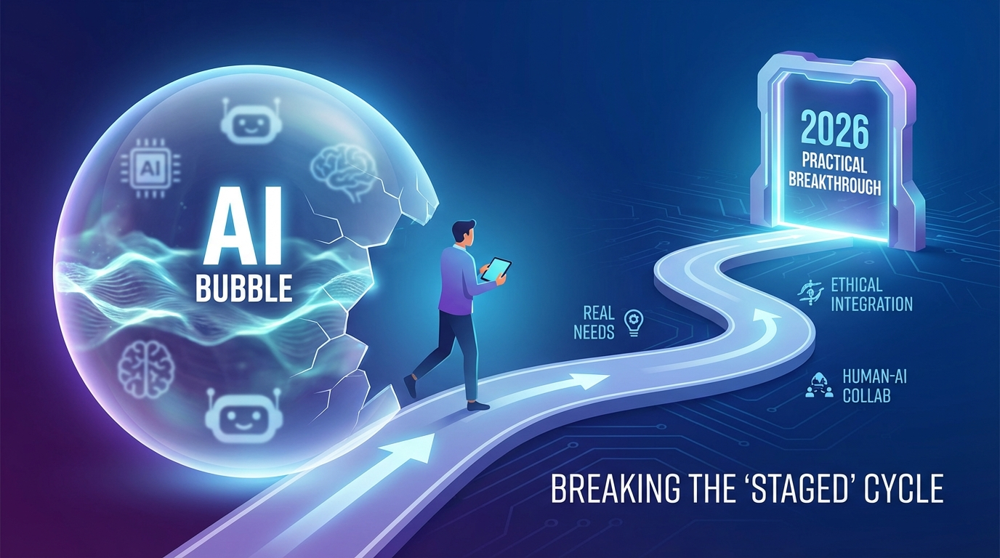

# 拒绝AI泡沫“摆拍”：2026实战型产品经理的突围路径图

**日期：2026年2月6日**

如果说2023年是AI的“元雷”，2024年是“狂热期”，那么站在2026年2月的当下，我们正处于一个关键的“去伪存真”时刻。

窗外，江浙沪皖正在迎接今年最大的雨雪，而科技圈的寒风也从未停止过对泡沫的清洗。最近的一则热门新闻发人深省：某博主为博流量，竟策划“摆拍孩子险被人贩子拐走”的视频，最终被警方处罚。这则新闻在产品圈引起了不小的共鸣——过去两年，有多少所谓的“AI产品”，其实也是一种“摆拍”？

仅靠套壳大模型、硬塞一个对话框、演示视频酷炫但落地即崩的“摆拍式”产品，在2026年已经彻底失去了市场。对于产品经理（PM）而言，单纯的“AI布道者”身份已不再吃香，市场迫切需要的是能够驾驭算法、落地场景的“实战派”。

## 一、 告别“摆拍”思维：从演示Demo到交付价值

回望过去，很多PM陷入了一个误区：认为只要接上了API，产品就有了AI灵魂。这就好比最近那个“摆拍人贩子”的博主，有了剧本和演员（大模型能力），却制造了一场虚假的社会焦虑（伪需求）。

在2026年，企业和用户已经极度理智。他们不再为“能写诗”的聊天机器人买单，他们关心的是ROI（投资回报率）。

**拒绝“为了AI而AI”：**
最近有新闻提到“追觅CEO‘贴脸开大’撒贝宁”，在硬科技领域，实力的展示是直接解决问题，而不是玩虚的。产品经理必须明白，AI不是产品的“美颜滤镜”，而是底层的“发动机”。
*   **反面教材：** 在一个简单的记账APP里强行加入“AI理财顾问”，用户问一句“我今天花了多少钱”，它却回一篇“理财的哲学意义”。
*   **实战路径：** 深入业务流。真正的AI记账，应该是自动识别票据、隐形归类、并在用户超支前做无感预警。

**警惕“除了快一无是处”：**
近期“新能源车侧滑起火”的新闻再次提醒我们，技术发展的底线是安全与稳定。2024年时，很多AI产品因为幻觉问题（Hallucination）导致数据错误，最终被企业客户抛弃。2026年的PM，必须把**“AI的可控性”**列为最高优先级。你不能交付一个偶尔会“发疯”的系统给B端客户，正如不能交付一辆随时会失控的汽车。

## 二、 2026年PM的能力重构：不仅是画图，更是“驯兽”

上海政协委员近期提出“取消中高考是早晚的事”，这一观点折射出教育评价体系的变革。同样的变革也发生在我们产品经理的职场评价体系中。死记硬背（单纯画原型、写文档）的技能正在贬值，而创造性思维和对新工具的掌控力成为核心。

**1. 从“指令员”进阶为“架构师”**
两年前，我们会写Prompt（提示词）就很厉害。现在，Prompt Engineering已是基本功。2026年的PM需要掌握的是**Agentic Workflow（智能体工作流）**的设计。
你需要思考：如何拆解一个复杂任务？如何让多个AI Agent协作？如何引入人类反馈回路（RLHF）来纠正AI的偏差？这需要PM具备极强的逻辑架构能力，而非仅仅是界面交互设计能力。

**2. 建立“私有数据”的护城河**
公有大模型的能力已经趋同，就像现在的自来水一样普及。产品的差异化，取决于你喂给AI什么数据。
实战型PM需要懂得如何清洗、标注、利用企业内部的私有数据。比如在医疗、法律或垂直电商领域，谁拥有更精准的“小数据”，谁就能调教出更懂业务的模型。这比单纯比拼模型参数量要重要得多。

## 三、 突围路径：在“冰雪”中燃起真火

正如最近冰雪经济“燃”起来一样，即便在资本的寒冬期，只要找对场景，依然能火热爆发。2026年的产品突围，关键在于“场景颗粒度”。

**路径一：重塑“非对话式”交互**
早期的AI产品几乎清一色是Chatbot（聊天框）。但现在我们发现，用户并不想一直打字。
*   **趋势：** LUI（语言用户界面）与GUI（图形用户界面）的深度融合。
*   **案例：** 现在的文档工具，不是要在旁边开个对话框问“帮我润色这段话”，而是当你选中一段文字时，AI自动提供三个不同语气的修改版本供选择。AI应该是“隐形”的，像空气一样存在于工作流中，而不是挡在路中间。

**路径二：情绪价值与伦理红线**
近期“爱泼斯坦案”相关文件曝光以及“女婴小洛熙离世”的悲剧，让社会对伦理和人性有了更深的思考。AI产品不仅是冷冰冰的工具，更涉及到伦理边界。
未来的PM在设计陪伴型、内容型AI产品时，必须置入严格的伦理护栏。同时，AI不应只是效率工具，更应提供正向的情绪价值。比如针对老年人的AI看护产品，重点不在于“监控”，而在于“关怀与连接”。

## 结语

2026年，AI已经祛魅。它不再是那个只需在PPT上画个大饼就能拿到融资的神话。

对于产品经理而言，这反而是最好的时代。因为市场不再喧嚣，我们可以沉下心来，拒绝那些花哨的“摆拍”功能，去解决那些真正棘手的问题——就像那位在雨雪天里还要处理复杂路况的司机，或者那位在寒冬中点燃冰雪经济的创业者。

**别做那个“在电梯口等20分钟”的被动者（参考男子住40层卖房新闻），要做那个主动砸窗救人的破局者。** 带上你的实战经验，去定义真正属于AI时代的超级产品。
