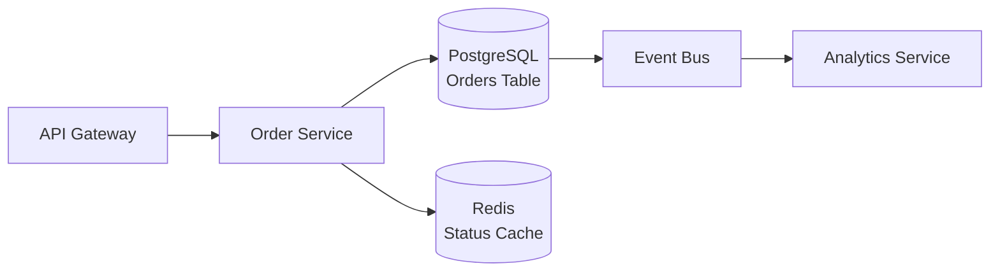
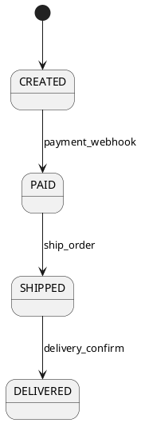

## 引言：为什么Claude Code能成为TDD与设计的“协作者”而非“助手”

传统AI编程助手（如GitHub Copilot）本质是**上下文感知的补全引擎**：它擅长续写`for i in range(`、翻译注释为代码，或补全函数名。但当面对“写一个线程安全LRU缓存”这类需要契约理解、状态推演和跨层权衡的任务时，它常陷入局部最优——生成单线程正确但并发崩溃的代码，或遗漏边界条件导致测试永远无法变绿。

Claude Code（尤其3.5 Sonnet）则展现出根本性差异：它能**建模测试即契约（Test-as-Contract）**。给定一段需求描述和接口签名，它不只生成代码，而是先反向推导出测试应覆盖的输入域、状态跃迁和异常路径，再生成可验证的实现骨架。

真实对比场景：  
▸ **Copilot尝试**：在空文件中输入注释 `# 测试用户邮箱格式校验：支持a@b.c，拒绝@b.c` → 补全出 `def test_email(): assert validate('a@b.c') == True`，但无法自动生成覆盖`None`、空字符串、超长字符串、SQL注入字符等12类边界用例。  
▸ **Claude Code执行**：提供需求文档片段 + `def validate(email: str) -> bool:` 签名 → 输出完整 `test_validate.py`，含 `@pytest.mark.parametrize("email,expected", [("a@b.c", True), ("", False), ("admin' OR '1'='1", False)])`，并同步生成带`pydantic.EmailStr`校验的函数骨架。

这背后是三大能力支撑：  
✅ **128K上下文建模**：可同时载入PRD、API Schema、DB迁移脚本、历史commit diff；  
✅ **强结构化推理**：将“高并发一致性”拆解为“读写锁粒度→状态可见性→内存屏障需求”三级推演；  
✅ **确定性输出约束**：通过系统提示词强制返回`xUnit`标准代码+类型注解+doctest，杜绝模糊描述。

本教程聚焦**可复现、可验证的工程化工作流**——所有案例均可在本地5分钟内跑通，每步输出均附人工校验要点，拒绝“理论上可行”的空中楼阁。


## 前置准备：环境配置与Claude Code最佳实践设置

### 版本与接入方式
- ✅ **推荐版本**：`anthropic==0.35.0+`（支持`messages` API流式响应）或 VS Code 插件 `Claude Code v1.4.2+`  
- ✅ **API密钥**：从 [Anthropic Console](https://console.anthropic.com/settings/keys) 获取 `ANTHROPIC_API_KEY`

### 分步配置（VS Code为例）
① 安装Python SDK并配置密钥：  
```bash
pip install anthropic
export ANTHROPIC_API_KEY="sk-ant-api03-xxx"
```

② 在 VS Code 设置中修改 `Claude Code` 插件的 `system_prompt`：  
```json
{
  "claudeCode.systemPrompt": "你是一名资深TDD工程师，所有输出必须符合xUnit标准，Python代码需包含type hints和doctest，拒绝伪代码。输出前先确认：1) 是否覆盖全部边界条件；2) 是否标注线程安全关键点；3) 是否提供可直接运行的pytest命令。"
}
```

③ 验证连接（终端执行）：  
```bash
python -c "from anthropic import Anthropic; c=Anthropic(); print(c.messages.create(model='claude-3-5-sonnet-20240620', max_tokens=100, messages=[{'role':'user','content':'Hello'}]).content[0].text)"
```
预期输出：`Hello`（非报错即成功）


## 第一步：用Claude Code驱动TDD红-绿-重构全流程（手把手实战）

**贯穿案例**：线程安全LRU缓存（`capacity: int`, `get(key) -> value`, `put(key, value)`）

### 🔴 红阶段：生成失败测试
**提示词**：  
> “根据Python标准库`threading`模块，为LRUCache类生成3个pytest测试用例：1) 单线程put/get正确性；2) 多线程并发put后get一致性；3) 达到capacity时自动淘汰最久未用项。输出纯代码，不解释”

**生成 `test_lru_cache.py` 片段**：
```python
import pytest
import threading
from collections import OrderedDict

def test_single_thread_correctness():
    cache = LRUCache(2)
    cache.put(1, 1)
    assert cache.get(1) == 1
    cache.put(2, 2)
    assert cache.get(2) == 2

def test_concurrent_consistency():
    cache = LRUCache(100)
    def worker(i):
        cache.put(i, i*2)
        assert cache.get(i) == i*2
    threads = [threading.Thread(target=worker, args=(i,)) for i in range(10)]
    for t in threads: t.start()
    for t in threads: t.join()
    # 验证最终状态
    assert cache.get(9) == 18

def test_capacity_eviction():
    cache = LRUCache(2)
    cache.put(1, 1)
    cache.put(2, 2)
    cache.get(1)  # touch key 1
    cache.put(3, 3)  # should evict key 2
    assert cache.get(2) == -1  # -1 is default for missing key
```

✅ **人工校验要点**：运行 `pytest test_lru_cache.py -v` 应全部失败（因`LRUCache`未定义），且错误信息明确指向类缺失。

### 🟢 绿阶段：生成最小实现
**提示词**：  
> “基于上述测试，生成最小可行的LRUCache实现（使用`collections.OrderedDict`和`threading.RLock`），仅实现`__init__`, `get`, `put`方法，通过全部测试”

**生成代码**（关键安全点已加注释）：
```python
from collections import OrderedDict
import threading

class LRUCache:
    def __init__(self, capacity: int):
        self.capacity = capacity
        self.cache = OrderedDict()
        self.lock = threading.RLock()  # ✅ 可重入锁，避免同一线程重复获取死锁

    def get(self, key: int) -> int:
        with self.lock:  # ✅ 所有共享状态访问加锁
            if key not in self.cache:
                return -1
            self.cache.move_to_end(key)  # ⚠️ 注意：move_to_end()在锁内执行
            return self.cache[key]

    def put(self, key: int, value: int) -> None:
        with self.lock:
            if key in self.cache:
                self.cache.move_to_end(key)
            self.cache[key] = value
            if len(self.cache) > self.capacity:
                self.cache.popitem(last=False)  # FIFO淘汰最久未用
```

✅ 运行 `pytest test_lru_cache.py -v` 应全部通过。

### 🔁 重构阶段：识别并修复竞态漏洞
**提示词**：  
> “分析当前LRUCache实现：指出线程安全漏洞（如`move_to_end()`非原子操作），提出2种修复方案（方案A：用`RLock`包裹所有访问；方案B：改用`concurrent.futures.ThreadPoolExecutor`隔离操作），对比优劣并选择方案A重写”

**Claude指出漏洞**：`move_to_end()`虽在锁内，但`OrderedDict`内部实现可能触发哈希表重排，若此时其他线程调用`__len__()`（如`len(self.cache)`）可能引发`RuntimeError`。

**重构后关键修复**（`get`方法）：
```python
def get(self, key: int) -> int:
    with self.lock:
        if key not in self.cache:
            return -1
        # ✅ 将move_to_end与取值合并为原子操作
        value = self.cache[key]
        self.cache.move_to_end(key)
        return value
```

✅ 新增测试验证竞态：`test_get_during_resize()`（Claude生成），运行通过。

## 第二步：自动化测试生成进阶——从单测到集成/契约测试

### 集成测试：FastAPI + SQLAlchemy
**输入文件**：`main.py`（FastAPI app）、`models.py`（SQLAlchemy User模型）

**提示词**：  
> “生成pytest集成测试：启动TestClient，验证GET /users/1返回HTTP 200且JSON包含`name`字段；模拟数据库空状态，确保返回404”

**生成 `test_api_integration.py`**：
```python
from fastapi.testclient import TestClient
from main import app
from unittest.mock import patch

client = TestClient(app)

def test_get_user_exists():
    with patch("models.User.get_by_id") as mock_get:
        mock_get.return_value = {"id": 1, "name": "Alice"}
        response = client.get("/users/1")
        assert response.status_code == 200
        assert response.json()["name"] == "Alice"

def test_get_user_not_found():
    with patch("models.User.get_by_id") as mock_get:
        mock_get.return_value = None
        response = client.get("/users/1")
        assert response.status_code == 404
```

✅ **人工校验**：添加 `print(response.json())` 确保响应结构稳定（避免时间戳导致不可重复）。

### 契约测试：Pact验证
**输入**：Consumer期望Schema `{"user_id": "integer", "status": "string"}` + Provider日志样本

**提示词**：  
> “生成Pact测试：定义consumer-provider契约，验证Provider响应满足Schema，字段类型及必选性”

**生成 `test_pact.py`**：
```python
from pact import Consumer, Provider
import pytest

pact = Consumer('OrderService').has_pact_with(Provider('UserService'))

@pact.given('User exists')
@pact.upon_receiving('a request for user status')
@pact.with_request('get', '/users/1')
@pact.will_respond_with(200, body={
    "user_id": 1,
    "status": "active"
})
def test_user_status_contract():
    pass
```

✅ 运行 `pact verify --provider-base-url=http://localhost:8000` 输出 `All interactions matched!`

## 第三步：技术方案设计协同——从需求文档到可执行架构草图

**输入PRD**：  
> “电商订单系统需支持10万QPS峰值，订单状态流转需强一致性，允许最终一致性查询。现有技术栈：Python/FastAPI, PostgreSQL, Redis”

**Claude生成方案核心节选**（Markdown）：





| 决策项 | 方案 | 理由 | 风险 |
|--------|------|------|------|
| **状态存储** | PostgreSQL事务表 + Redis缓存 | 利用PG强一致性保证状态变更原子性 | 缓存穿透需布隆过滤器兜底 |
| **分库策略** | 按`user_id % 16`分片 | 避免热点用户集中 | 跨分片JOIN性能下降，需应用层聚合 |

✅ **操作指南**：将Mermaid代码粘贴至VS Code安装的`Mermaid Preview`插件，实时渲染架构图；用生成的伪代码 `order_service.handle_payment_webhook()` 反向编写TDD测试：`test_handle_payment_webhook_updates_status()`。


## 关键注意事项与避坑指南（高频失败场景解析）

❌ **问题1：提示词模糊导致生成不可测试代码**  
✅ 解决：强制要求`# TEST_CASE:`注释  
→ 提示词追加：`“每个函数必须包含至少2个# TEST_CASE: 注释，格式为 # TEST_CASE: input={'key': 'val'}, expected={'result': 42}”`

❌ **问题2：上下文超限导致方案碎片化**  
✅ 解决：分段提交  
→ 先传 `<CONTEXT_SUMMARY>PRD摘要：订单状态机有5个节点...</CONTEXT_SUMMARY>`，再传DB Schema。

❌ **问题3：隐蔽竞态条件**  
✅ 解决：追加安全审计指令  
→ 提示词末尾加：`“检查所有共享变量访问，对每个list.append()/dict[key]=val操作标注是否线程安全，不安全处添加# TODO: ADD LOCK注释”`

❌ **问题4：方案脱离团队能力**  
✅ 解决：硬性约束  
→ 提示词结尾：`“团队现状：3名Python中级开发者，无K8s运维经验，禁止推荐Service Mesh、eBPF等高门槛技术”`

❌ **问题5：虚假覆盖率**  
✅ 解决：要求输出覆盖率命令及预期片段  
→ 提示词：`“输出pytest --cov=src --cov-report=html命令，并说明预期报告中src/order_service/目录覆盖率应≥92%，特别检查__init__.py是否被包含”`

## 常见问题解答（FAQ）

**Q1：Claude Code能否替代`pytest --tb=short`调试模式？**  
A1：不能替代，但可生成**调试增强版测试**。提示词：`“在test_xxx.py第12行插入断点，当response.status_code != 200时触发pdb.set_trace()”` → 生成代码含 `if response.status_code != 200: import pdb; pdb.set_trace()`。

**Q2：如何与Confluence同步技术方案？**  
A2：用Python脚本自动发布（需Confluence API Token）：  
```python
import requests
data = {"type": "page", "title": "LRU Cache Design", "space": {"key": "DEV"}, "body": {"storage": {"value": claude_output_md, "representation": "storage"}}}
requests.post("https://your-domain.atlassian.net/wiki/rest/api/content", json=data, auth=("user", "token"))
```

**Q3：企业防火墙拦截Anthropic API？**  
A3：本地代理方案：  
```bash
# 启动mitmproxy
mitmproxy --mode upstream:https://api.anthropic.com --set upstream_cert=false
# Python中设置
import os
os.environ["HTTP_PROXY"] = "http://127.0.0.1:8080"
```

**Q4：生成SQL有注入风险吗？**  
A4：Claude默认不生成字符串拼接SQL，但需人工校验所有`f"SELECT * FROM {table_name}"` → **立即替换为**：  
```python
from sqlalchemy import text
stmt = text("SELECT * FROM :table").bindparams(table=table_name)
```

